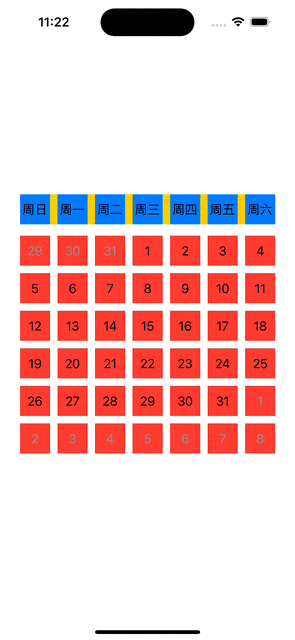
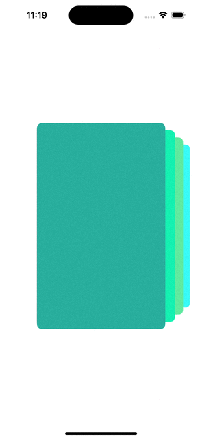
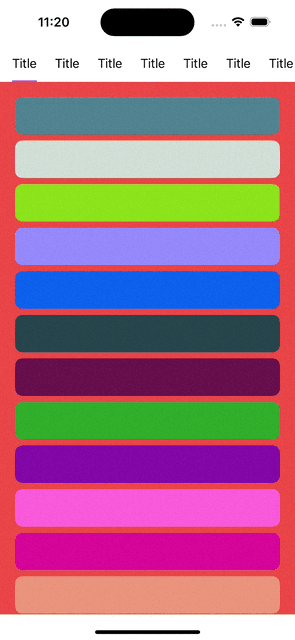
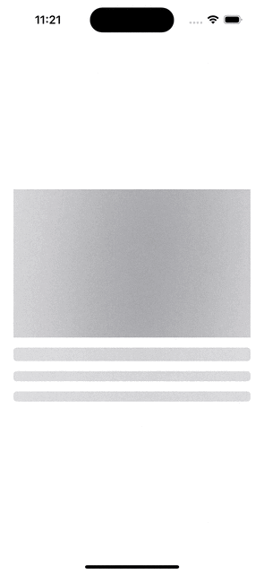

# SwiftUI-Animations
- [SwiftUI动画学习笔记](AnimationREADME.md)

# 用SwiftUI实现常用的控件
| 名称 | 效果 |名称 | 效果 |
|---------|---------|---------|---------|
| [下拉刷新](SwiftUI-Animations/PullToRefresh)    |   | [日历视图](SwiftUI-Animations/Calendar) |  |
| [卡包视图](SwiftUI-Animations/LoopingStack)    |   | [分类Tab](SwiftUI-Animations/SegmentTab) |  |

| [骨架图](SwiftUI-Animations/Skeleton)    |   | -| - |