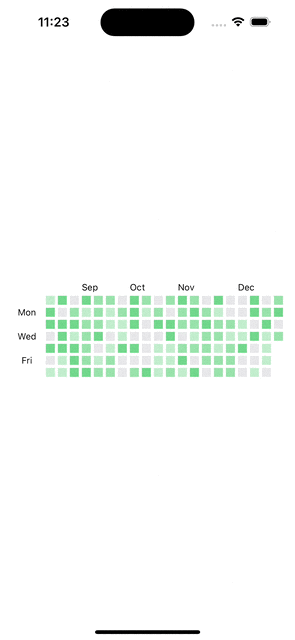

# SwiftUI-Animations
- [SwiftUI动画学习笔记](AnimationREADME.md)

# 用SwiftUI实现常用的控件
- [下拉刷新](SwiftUI-Animations/PullToRefresh)
    
- [日历视图](SwiftUI-Animations/Calendar)
    
- [热力图](SwiftUI-Animations/Calendar/HeatMapView.swift)
    
- [卡包视图](SwiftUI-Animations/LoopingStack)
    
- [分类Tab](SwiftUI-Animations/SegmentTab)
    
- [骨架图](SwiftUI-Animations/Skeleton)
    

| 列标题1 | 效果 |
|---------|---------|
| [下拉刷新](SwiftUI-Animations/PullToRefresh)    |     |