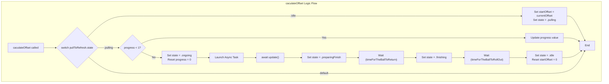

# PullToRefresh for SwiftUI

This document explains how to use the custom `PullToRefresh` component and the principles behind its implementation.

## How to Use

To add the pull-to-refresh functionality to your `ScrollView`, follow these steps. You can refer to `PullToRefreshSampleView.swift` for a working example.

### 1. State Management

In your view, create a `@State` variable to hold the pull-to-refresh state.

```swift
@State var pullToRefresh = PullToRefresh(progress: 0, state: .idle)
```

### 2. View Hierarchy

Structure your view's body as follows:

1.  Use a `ScrollView` as the root container.
2.  Place the `ScrollViewGeometryReader` at the very top inside the `ScrollView`. This component is responsible for detecting the scroll gesture. Pass it a binding to your state variable and the `async` function that should be executed to refresh your data.
3.  Inside a `ZStack`, place the `BallView` (the animation) and your scrollable content (e.g., in a `LazyVStack`).
4.  Apply a `.offset` modifier to your content view. The offset should be active when the state is `.ongoing` or `.preparingFinish` to make space for the jumping ball animation.
5.  Apply an `.animation` modifier to the content view to ensure smooth transitions when the offset changes.

Here is a minimal example of the view structure:

```swift
struct MyContentView: View {
    @State var events: [Event] = []
    @State var pullToRefresh = PullToRefresh(progress: 0, state: .idle)
    
    // Define your animations
    private let ease: Animation = .easeInOut(duration: Constants.timeForTheBallToReturn)
    private let spring: Animation = .interpolatingSpring(stiffness: 80, damping: 4)

    var body: some View {
        ScrollView {
            // Step 2: Add the geometry reader for scroll detection
            ScrollViewGeometryReader(pullToRefresh: $pullToRefresh) {
                // The async refresh action
                await update()
            }
            
            ZStack(alignment: .top) {
                // Step 3: Add the animation view
                BallView(pullToRefresh: $pullToRefresh)

                // Your content
                LazyVStack {
                    ForEach(events) { event in
                        EventView(event: event)
                    }
                }
                // Step 4: Offset the content during refresh
                .offset(
                    y: [.ongoing, .preparingFinish].contains(pullToRefresh.state) ? Constants.maxOffset : 0
                )
                // Step 5: Animate the offset change
                .animation(pullToRefresh.state != .finishing ? spring : ease, value: pullToRefresh.state)
            }
        }
    }
    
    // The function to fetch new data
    @MainActor
    func update() async {
        events = await fetchMoreEvents(toAppend: events)
    }
}
```

## How It Works

The `PullToRefresh` functionality is a state machine driven by the user's scroll gesture, composed of several key components.

### Core Components

-   **`PullToRefresh.swift`**: Defines the core data structures.
    -   `PullToRefresh`: A struct holding the current `progress` (0.0 to 1.0) of the pull gesture and the current `state`.
    -   `AnimationState`: An enum representing the different stages of the process: `idle`, `pulling`, `ongoing`, `preparingFinish`, and `finishing`.

-   **`ScrollViewGeometryReader.swift`**: The brain of the operation.
    -   It embeds a `GeometryReader` in the `ScrollView`'s coordinate space.
    -   By reading the `minY` of its frame in the `.global` space, it constantly calculates the scroll offset.
    -   A `switch` statement on the current `AnimationState` functions as a state machine. It transitions between states based on the scroll offset, triggering the data refresh and managing the animation lifecycle. For instance, when the user pulls down far enough (`progress` hits 1.0), it changes the state to `.ongoing` and calls the `update` closure.

-   **`BallView.swift`**: The visual feedback for the user.
    -   This view also observes the `PullToRefresh` state.
    -   It switches between two sub-views:
        -   `RollingBallView`: Active during `.pulling` and `.finishing`. It shows a ball rolling horizontally. The ball's position is directly mapped to the `progress` value during the pull.
        -   `JumpingBallView`: Active during `.ongoing` (the loading state) and `.preparingFinish`. It displays a continuously bouncing ball animation to indicate that a background task is running.

-   **`Constants.swift`**: Contains all the magic numbers for the animations, such as durations, sizes, and offsets, making them easy to tweak.

### The State Machine Flow

1.  **`idle`**: The default state. The view is waiting for the user to pull down.
2.  **`pulling`**: When the user starts pulling down, the state changes to `pulling`. `ScrollViewGeometryReader` calculates the `progress` of the pull. `BallView` shows the ball rolling in, its position corresponding to the `progress`.
3.  **`ongoing`**: Once `progress` reaches 1.0, the state becomes `ongoing`. The async `update` function is called to fetch data. `BallView` switches to the `JumpingBallView`, showing a loading animation. The main content is offset downwards to make room for the `BallView`.
4.  **`preparingFinish`**: After the `update` function completes, the state transitions to `preparingFinish`. The `JumpingBallView` plays a final animation to move the ball back to its starting position for the rollout.
5.  **`finishing`**: The state changes to `finishing`. The main content animates back to its original position. `BallView` switches back to `RollingBallView` to play an animation of the ball rolling off-screen.
6.  **`idle`**: Once the "finish" animation is complete, the system returns to the `idle` state, ready for the next refresh. 

### `caculateOffset` Logic Flow

The following diagram illustrates the state transition logic within the `caculateOffset` function, which is the core of the refresh state machine.

